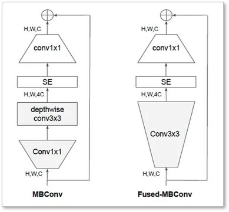
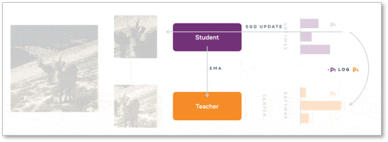
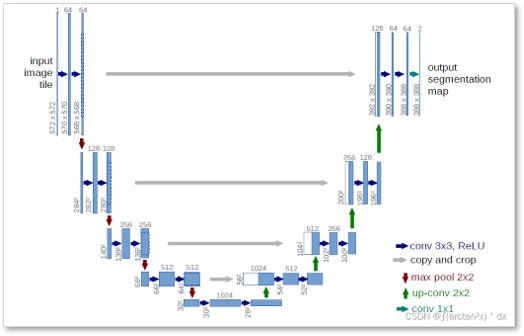
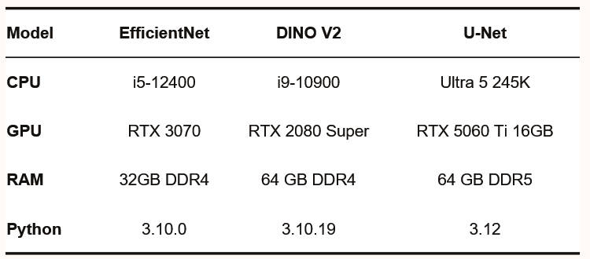
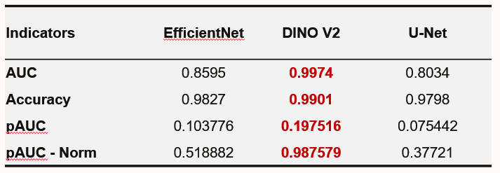

# AI_2025_final_project
#
## Kaggle 比賽
#### 官網 : https://www.kaggle.com/competitions/isic-2024-challenge/overview
#### 資料集 : https://www.kaggle.com/competitions/isic-2024-challenge/data
#
## 模型介紹
#
## Efficient V2
### 架構

### Files include:
####  efficientnet_v2.py (訓練用)
####  eval_effficientnet_v2.py (驗證用)
####  isic_pauc.py (驗證用撘配上方驗證一起用)
#
## DINO V2
### 架構

### LoRa策略

### Files include:
####  dino_v2.py
####  eval_dino_v2.py
####  isic_pauc.py
#
## U-Net
### 架構

### Files include:
####  train_unet_v2
####  eval_unet_unified
####  isic_pauc.py
#
## Result
### Environment
#### 環境預設建議使用 Anaconda 做部屬，方便管理!
#### 環境架設依照個模型所需import 的套件即可使用

### Confusion Matrix

### pAUC Compare

